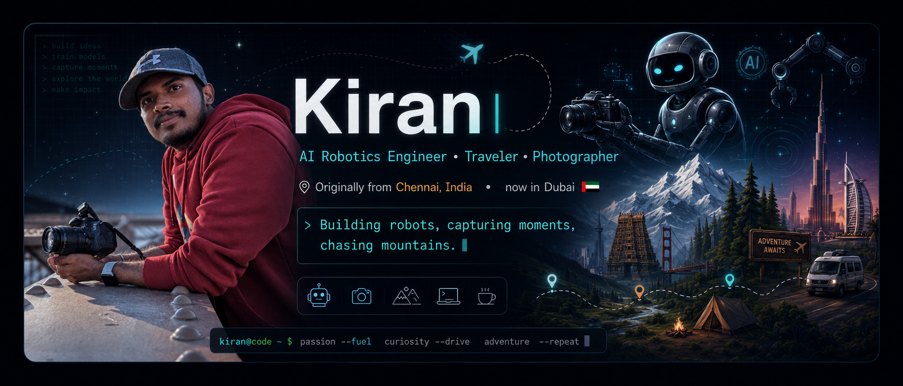
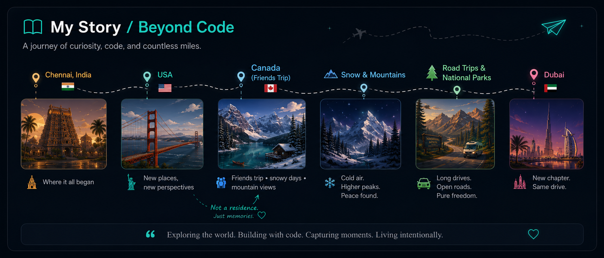
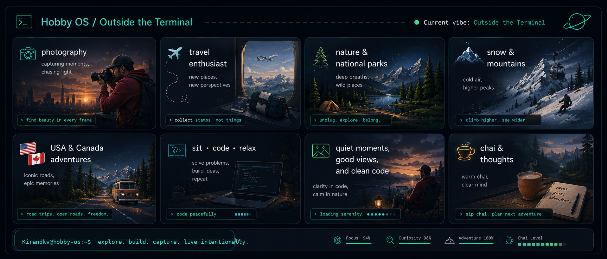
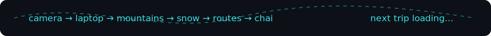
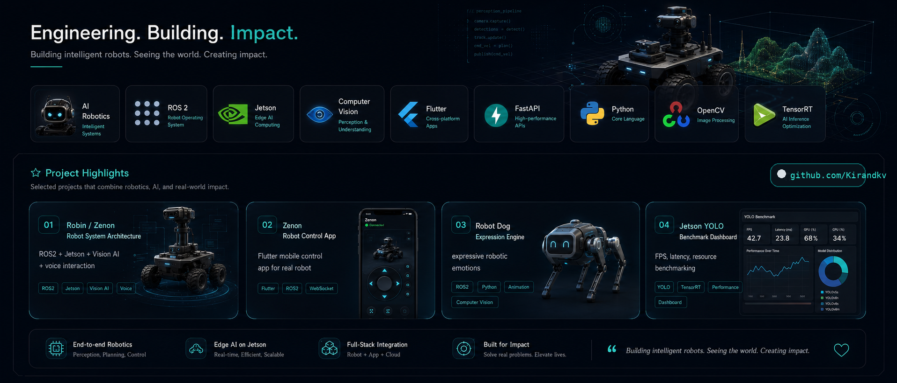

  

<h1 align="center">Hi, I'm Kiran 👋</h1>

<h3 align="center">AI Software Engineer • Traveler • Photographer</h3>

  Originally from <b>Chennai, India</b> 🇮🇳 &nbsp;•&nbsp; Currently in <b>Dubai, UAE</b> 🇦🇪

  Building robots, capturing moments, and chasing mountains.

  
  
  

---

  

## 🧭 About Me

I work at the intersection of **AI, Robotics, Edge AI, Computer Vision, and real-world deployment**.

I enjoy building intelligent systems that can:

- **see** through computer vision
- **understand** through AI pipelines
- **interact** through apps and APIs
- **move** through robotics and control systems
- **run efficiently** on edge hardware like NVIDIA Jetson

Outside engineering, I love **travel, photography, snow, mountains, nature, road trips, national parks**, and simply **sitting down to code and relax with chai**.

---

## 📖 My Story / Beyond Code

  

---

## 🖥️ Hobby OS / Outside the Terminal

  

  

---

## 🤖 Engineering the Future

  

### Core Stack

  
  
  
  
  
  
  
  
  

---

## 🚀 Featured Projects

<table>
  <tr>
    <td width="50%" valign="top">
      <h3>🤖 <a href="https://github.com/Kirandkv/System_arch">Robin / Zenon Robot System Architecture</a></h3>
      

        End-to-end robot system architecture for perception, interaction, planning, control,
        and real-world edge deployment.
      

      
<b>Focus:</b> ROS2, Jetson, Vision AI, face recognition, voice interaction, robot app/backend integration

    </td>
    <td width="50%" valign="top">
      <h3>📱 <a href="https://github.com/Kirandkv/zenon_robot_app">Zenon Robot Control App</a></h3>
      

        Flutter mobile app for monitoring, controlling, and interacting with the Zenon robot through a clean robot-control dashboard.
      

      
<b>Focus:</b> Flutter, Dart, mobile UI, robot controls, app-to-robot communication

    </td>
  </tr>
  <tr>
    <td width="50%" valign="top">
      <h3>🐶 Robot Dog Expression Engine <i>(building next)</i></h3>
      

        Expressive robot-dog emotion system with animated states like listening, happy, curious, sleepy, and excited.
      

      
<b>Focus:</b> Python, OpenCV, animation states, robot personality, human-robot interaction

    </td>
    <td width="50%" valign="top">
      <h3>📊 Jetson YOLO Benchmark Dashboard <i>(building next)</i></h3>
      

        Edge-AI benchmarking dashboard for FPS, latency, CPU/GPU/RAM usage, and TensorRT model comparison.
      

      
<b>Focus:</b> YOLO, TensorRT, FastAPI, Jetson monitoring, real-time metrics

    </td>
  </tr>
</table>

---

## 🧩 Other Public Work

<table>
  <tr>
    <td width="50%" valign="top">
      <h3>⚡ <a href="https://github.com/Kirandkv/Spike_detect">Spike_detect</a></h3>
      
Detection-focused public repo from my GitHub profile. I’m cleaning this into a stronger portfolio demo with clearer documentation and visuals.

    </td>
    <td width="50%" valign="top">
      <h3>⏰ <a href="https://github.com/Kirandkv/alarm-clock-cli">alarm-clock-cli</a></h3>
      
Python command-line utility project showing practical scripting, terminal workflows, and lightweight tool building.

    </td>
  </tr>
</table>

---

## 📈 GitHub Stats

  
  

  

---

## 📌 Current Focus

- Building cool robot projects 🤖
- Exploring Edge AI and Computer Vision
- Improving robot interaction systems
- Creating better mobile robot-control experiences
- Capturing travel moments around the world 📷
- Planning the next adventure ✈️

---

## 🌐 Connect

- **GitHub:** [github.com/Kirandkv](https://github.com/Kirandkv)
- **Robotics Org:** [github.com/zenonroboticsco-bot](https://github.com/zenonroboticsco-bot)

<!-- Add these later when ready:
- LinkedIn: https://www.linkedin.com/in/YOUR-LINKEDIN
- Portfolio: https://YOUR-PORTFOLIO.com
-->

---

---

  <i>Exploring the world. Building with code. Capturing moments. Living intentionally.</i>

